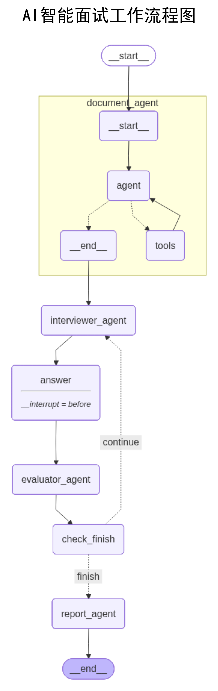

# AI智能面试辅助系统 V1.0 🤖

> 作者：刘梦畅

这是一个基于大语言模型（LLM）和 LangGraph 工作流引擎开发的智能模拟面试系统。它能够模拟真实的面试场景，通过简历解析、针对性提问和实时评估，帮助求职者提升面试表现。

## ✨ 项目亮点

- **LangGraph 工作流架构**：采用专业的 Agent 工作流设计，实现从简历解析到报告生成的完整面试逻辑
- **子图可视化**：文档解析 Agent 作为独立子图展示，工作流结构清晰可见
- **智能交互**：AI 会根据你的回答进行追问，模拟真实面试的深度
- **流式输出**：采用 SSE 协议实现打字机效果，提供流畅的用户体验
- **全栈实现**：包含完整的 Python 后端接口和简洁美观的前端交互界面
- **专业评估**：面试结束后自动生成多维度的评价报告，指出优缺点和改进建议

## 🛠️ 技术架构

### 后端技术栈
- **核心框架**: Python 3.9+, FastAPI
- **AI 框架**: LangChain, LangGraph
- **LLM**: 支持 OpenAI API 兼容接口
- **数据库**: SQLAlchemy (SQLite)
- **文档解析**: PyPDF2, python-docx

### 前端技术栈
- **技术**: 原生 HTML, CSS, JavaScript
- **设计**: 现代简约设计，响应式布局
- **通信**: SSE (Server-Sent Events) 实现流式输出

### 工作流架构图

系统采用 LangGraph 工作流引擎，实现了完整的面试流程自动化：

<div align="center">
    
</div>

**工作流说明**：
1. **START** → **parse_resume**（简历解析节点）：解析 PDF 格式简历
2. **parse_resume** → **interviewer_agent**（面试官 Agent）：基于简历生成针对性问题
3. **interviewer_agent** → **answer**（用户回答节点）：等待用户输入答案（中断点）
4. **answer** → **evaluator_agent**（评价 Agent）：多维度评估用户回答
5. **evaluator_agent** → **check_finish**（检查完成节点）：判断是否完成所有轮次
6. **check_finish** → **interviewer_agent**（继续）或 **report_agent**（结束）：条件路由
7. **report_agent** → **END**：生成最终面试报告

> 💡 **提示**：运行 `python backend/test_graph_visualization.py` 可在项目根目录生成最新的工作流可视化图

## 📂 项目结构

```
Interview/
├── backend/                    # 后端代码
│   ├── config/                # 配置模块
│   │   ├── config.py         # 环境变量配置
│   │   └── database.py       # 数据库配置
│   ├── graph/                 # LangGraph 工作流
│   │   ├── agents/           # Agent 定义
│   │   │   └── document_agent.py  # 文档解析 Agent
│   │   ├── nodes/            # 工作流节点
│   │   │   ├── parse_resume_node.py      # 简历解析节点
│   │   │   ├── ask_question_node.py      # 出题节点
│   │   │   ├── answer_node.py            # 回答节点
│   │   │   ├── evaluate_node.py          # 评价节点
│   │   │   ├── check_finish_node.py      # 检查完成节点
│   │   │   └── generate_report_node.py   # 报告生成节点
│   │   ├── tools/            # 工具函数
│   │   │   ├── pdf_parser.py    # PDF 解析工具
│   │   │   └── word_parser.py   # Word 解析工具
│   │   ├── state/            # 状态定义
│   │   │   └── interview_state.py  # 面试状态
│   │   ├── workflow/         # 工作流定义
│   │   │   └── interview_workflow.py  # 面试工作流
│   │   └── llm/              # LLM 辅助
│   │       └── llm_helper.py    # LLM 实例管理
│   ├── models/               # 数据模型
│   │   ├── user.py          # 用户模型
│   │   ├── interview_record.py  # 面试记录模型
│   │   └── schemas.py       # API 数据模型
│   ├── routes/              # API 路由
│   │   ├── interview_routes.py  # 面试相关接口
│   │   └── auth_routes.py      # 用户认证接口
│   └── main.py              # 应用入口
├── frontend/                # 前端代码
│   ├── index.html          # 主页面
│   ├── css/                # 样式文件
│   └── js/                 # JavaScript 脚本
├── requirements.txt        # Python 依赖
└── README.md              # 项目说明
```

## 🚀 快速上手

### 1. 环境准备
确保你的电脑已安装 Python 3.9+ 以及 Git。

### 2. 克隆并安装
```bash
# 克隆项目
git clone https://github.com/Lucky-LMC/AI-Interview.git

# 创建虚拟环境（推荐）
python -m venv venv
source venv/bin/activate  # Windows: venv\Scripts\activate

# 安装依赖
pip install -r requirements.txt
```

### 3. 配置环境变量
创建 `.env` 文件并配置以下参数：
```env
# OpenAI API 配置
OPENAI_API_KEY=your_api_key_here
OPENAI_API_BASE=https://api.openai.com/v1
MODEL_NAME=gpt-4

# 面试配置
TEMPERATURE=0.7

# 数据库配置（可选，默认使用 SQLite）
DATABASE_URL=sqlite:///./interview.db
```

### 4. 启动服务
```bash
# 启动后端服务
cd backend
python main.py

# 服务将在 http://localhost:8000 启动
# 前端页面可通过 http://localhost:8000 访问
```

### 5. 可视化工作流（可选）
```bash
# 生成工作流可视化图（保存到项目根目录）
python backend/test_graph_visualization.py
```

生成的图片将保存到项目根目录：
- `workflow_graph.png`：带标题的完整版工作流图

## 📖 使用说明

1. **注册/登录**：首次使用需要注册账号
2. **上传简历**：支持 PDF 和 Word 格式
3. **开始面试**：系统会自动解析简历并生成第一个问题
4. **回答问题**：输入你的回答，AI 会进行评价并提出下一个问题
5. **查看报告**：完成所有轮次后，系统会生成详细的面试报告

## 🎯 核心功能

### 1. 智能简历解析
- 使用 LangGraph Agent 自动识别文件类型
- 支持 PDF 和 Word 文档
- 提取关键信息用于后续提问

### 2. 动态问题生成
- 基于简历内容生成针对性问题
- 三轮面试：技术类、沟通类、HR类
- 避免重复提问

### 3. 实时评价反馈
- 多维度评分（技术准确性、完整性、表达清晰度、实践经验）
- 详细的改进建议
- 流式输出，实时展示

### 4. 面试报告生成
- 整体表现总结
- 优势与不足分析
- 录用建议
- 改进方向

## 🔧 技术特性

### LangGraph 工作流设计
- **状态管理**：使用 TypedDict 定义面试状态
- **节点编排**：清晰的节点职责划分
- **条件路由**：根据面试进度动态决策
- **中断机制**：在用户回答前中断，实现交互式对话
- **子图展示**：文档解析 Agent 作为独立子图可视化

### 代码架构
- **分层设计**：配置层、数据层、业务层、路由层清晰分离
- **包管理**：规范的 Python 包结构，便于维护和扩展
- **类型安全**：使用 TypedDict 和类型注解
- **单例模式**：LLM 实例复用，提高性能

## 📝 开发说明

### 添加新节点
1. 在 `backend/graph/nodes/` 创建新节点文件
2. 定义节点函数，接收 `InterviewState` 并返回更新后的状态
3. 在 `backend/graph/nodes/__init__.py` 导出
4. 在 `backend/graph/workflow/interview_workflow.py` 中添加到工作流

### 自定义 Agent
1. 在 `backend/graph/agents/` 创建新 Agent
2. 使用 `create_react_agent` 创建 Agent 实例
3. 全局实例化以支持子图可视化
4. 在相应节点中调用

## 🤝 贡献指南

欢迎提交 Issue 和 Pull Request！

## 📄 许可证

MIT License

## 👨‍💻 作者

刘梦畅

---

**注意**：本项目仅供学习和研究使用，请勿用于商业用途。
